<div align="center">

<picture>
  <source media="(prefers-color-scheme: dark)" srcset="./dark.svg">
  <source media="(prefers-color-scheme: light)" srcset="./light.svg">
  
</picture>

# Majji Jeevan Sai

**Full Stack Developer · AI/ML Engineer · Backend Developer · Automation Builder**

Building production-grade web applications, intelligent automation systems, and scalable backend services.

[](https://github.com/jeevansai-hub)
[](https://linkedin.com/in/jeevan-sai-majji)
[](mailto:jeevansaimajji@gmail.com)

</div>

## About Me

- 🎓 B.Tech student in **Artificial Intelligence & Data Science**
- 📍 Based in **Visakhapatnam, Andhra Pradesh, India**
- 💻 Building with **React, TypeScript, Node.js, NestJS, Python, PostgreSQL, and AWS**
- 🤖 Exploring **AI agents, workflow automation, RAG systems, and intelligent enterprise applications**
- 🚀 Focused on clean architecture, responsive UI, reliable APIs, and production-ready engineering

## Tech Stack

```text
Frontend     React · Next.js · TypeScript · Tailwind CSS · Framer Motion
Backend      Node.js · NestJS · Express.js · REST APIs · WebSockets
AI / Data    Python · LangChain · RAG · Pandas · NumPy · Machine Learning
Database     PostgreSQL · MongoDB · Redis · pgvector
Cloud/Tools  AWS · Docker · Git · GitHub · n8n · Figma
```

## Current Focus

```ts
const jeevan = {
  role: ["Full Stack Developer", "AI/ML Engineer", "Backend Developer"],
  learning: ["System Design", "AI Agents", "Scalable Backend Architecture"],
  building: ["Enterprise Applications", "Automation Workflows", "Developer Tools"],
  principle: "Build clean, useful, reliable software."
};
```

## GitHub Activity

<div align="center">


</div>

---

<div align="center">

**Open to software engineering, full-stack, backend, AI/ML, and automation opportunities.**

</div>
