<picture>
  <source media="(prefers-color-scheme: dark)" srcset="./dark.svg">
  <source media="(prefers-color-scheme: light)" srcset="./light.svg">
  
</picture>

### Building scalable software at the intersection of AI, cloud and thoughtful engineering.

## About me

I'm **Majji Jeevan Sai**, an AI-focused full-stack developer and **SDE Intern at MediKloud** from Visakhapatnam, India. I build production-oriented software across applied AI, intelligent automation, cloud-native backends and user-facing products.

- Building scalable software and intelligent automation systems
- Exploring system design, distributed systems and cloud-native architecture
- Working with AI agents, LLM workflows and real-world ML applications
- Pursuing a B.Tech in Artificial Intelligence & Data Science
- Open to collaborating on impactful open-source projects

## Engineering toolkit

## Selected work

| Project | What it does | Core stack |
|---|---|---|
| **Enterprise AI Agent Automation Platform** | Orchestrates AI agents, LLM prompts, APIs and event-driven workflows for business automation. | Python, n8n, LangChain, APIs, Cloud |
| **Smart Citizen Hub** | Uses intelligent image verification and routing to streamline municipal complaint resolution. | MERN, TensorFlow.js, OpenCV, AWS |
| **Adaptive Intelligence for Agriculture** | Runs low-latency plant-stress detection and closed-loop irrigation decisions at the edge. | TensorFlow Lite, ESP32, MQTT, Cloud |

## Experience highlights

- Engineered analytics dashboards and reusable data pipelines that reduced manual reporting effort by **40%**.
- Improved workflow performance by **30%** through structured exploratory analysis and process optimization.
- Built image-verification workflows that reduced false complaint reports by **60%**.
- Designed intelligent routing that accelerated issue resolution by **80%**.
- Developed an Edge AI irrigation system with **sub-2-second inference** and **35% lower water consumption**.
- Led the internal Smart India Hackathon-winning **Smart Citizen Hub** team.

## GitHub activity

---

**Open to engineering collaborations, open-source work and ambitious product ideas.**

Portfolio and X profile — coming soon.

